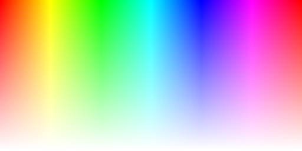
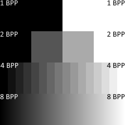
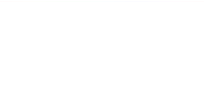
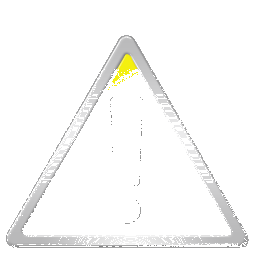
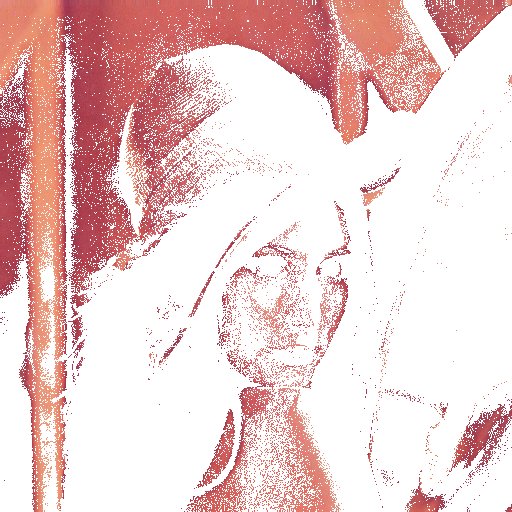

[](https://kgysoft.net)

# KGy SOFT Drawing Libraries

KGy SOFT Drawing Libraries offer advanced bitmap data manipulation and image processing features such as quantizing and dithering. The libraries consist of multiple packages. A core library contains the technology-agnostic and platform independent functionality and there are specialized libraries built upon the core package.

[](https://kgysoft.net/drawing)
[](https://docs.kgysoft.net/drawing)
[](https://github.com/koszeggy/KGySoft.Drawing)
[](https://www.nuget.org/packages/KGySoft.Drawing)
[](https://github.com/koszeggy/KGySoft.Drawing.Tools)

## Table of Contents:
1. [Download](#download)
   - [Available Packages](#available-packages)
   - [Application Examples](#application-examples)
2. [Project Site](#project-site)
3. [Documentation](#documentation)
4. [Release Notes](#release-notes)
5. [Examples](#examples)
   - [Icon Manipulation](#icon-manipulation)
   - [Fast Bitmap Manipulation](#fast-bitmap-manipulation)
   - [Managed Bitmap Data Manipulation](#managed-bitmap-data-manipulation)
   - [WriteableBitmap and Other 3rd Party Bitmap Types Support](#writeablebitmap-and-other-3rd-party-bitmap-types-support)
   - [Supporting Custom Pixel Formats](#supporting-custom-pixel-formats)
   - [Quantizing and Dithering](#quantizing-and-dithering)
   - [Advanced GIF Encoder with High Color Support](#advanced-gif-encoder-with-high-color-support)
6. [License](#license)

## Download:

### Available Packages:

Starting with version 7.0.0 KGy SOFT Drawing Libraries are available in multiple packages:

> ⚠️ _Note_: Version 7.0.0 is currently in preview. As a stable release, you can only download the combined `KGySoft.Drawing` package so far. Version 7.0.0 intruduces several major breaking changes due to the assembly split. Feel free to refer to the [release notes](#release-notes).

#### [KGySoft.Drawing.Core](https://www.nuget.org/packages/KGySoft.Drawing.Core)

This package contains the platform-independent core functionality that mainly resides in the [KGySoft.Drawing.Imaging](https://docs.kgysoft.net/drawing/?topic=html/N_KGySoft_Drawing_Imaging.htm) namespace.

Main highlights:
- Creating [managed bitmap data](http://docs.kgysoft.net/drawing/?topic=html/T_KGySoft_Drawing_Imaging_BitmapDataFactory.htm) of any pixel format.
- Creating bitmap data for any preallocated buffer using any pixel format. This allows accessing the pixels of bitmaps of any technology if the bitmap data is exposed as a pointer or array.
- Quantizing using [predefined](https://docs.kgysoft.net/drawing/?topic=html/T_KGySoft_Drawing_Imaging_PredefinedColorsQuantizer.htm) or [optimized](https://docs.kgysoft.net/drawing/?topic=html/T_KGySoft_Drawing_Imaging_OptimizedPaletteQuantizer.htm) colors
- Dithering using [ordered](https://docs.kgysoft.net/drawing/?topic=html/T_KGySoft_Drawing_Imaging_OrderedDitherer.htm), [error diffusion](https://docs.kgysoft.net/drawing/?topic=html/T_KGySoft_Drawing_Imaging_ErrorDiffusionDitherer.htm), [random noise](https://docs.kgysoft.net/drawing/?topic=html/T_KGySoft_Drawing_Imaging_RandomNoiseDitherer.htm) or [interleaved gradient noise](https://docs.kgysoft.net/drawing/?topic=html/T_KGySoft_Drawing_Imaging_InterleavedGradientNoiseDitherer.htm) dithering techniques
- Creating [GIF animations](https://docs.kgysoft.net/drawing/?topic=html/T_KGySoft_Drawing_Imaging_GifEncoder.htm) even in high color

The package can be downloaded directly from [NuGet](https://www.nuget.org/packages/KGySoft.Drawing.Core) or by using the Package Manager Console:

    PM> Install-Package KGySoft.Drawing.Core

#### [KGySoft.Drawing](https://www.nuget.org/packages/KGySoft.Drawing)

This package provides special support for `System.Drawing` types such as `Bitmap`, `Metafile`, `Image`, `Icon`, `Graphics`. In .NET 7 and above this package can be used on Windows only. When targeting earlier versions, Unix/Linux based systems are also supported (if the libgdiplus library is installed).

Main highlights:
- Fast [direct native Bitmap data access](https://docs.kgysoft.net/drawing/?topic=html/M_KGySoft_Drawing_BitmapExtensions_GetReadWriteBitmapData.htm) for every PixelFormat
- [Quantizing](https://docs.kgysoft.net/drawing/?topic=html/M_KGySoft_Drawing_BitmapExtensions_Quantize.htm) and [dithering](https://docs.kgysoft.net/drawing/?topic=html/M_KGySoft_Drawing_BitmapExtensions_Dither.htm)
- Creating [GIF animations](https://docs.kgysoft.net/drawing/?topic=html/Overload_KGySoft_Drawing_ImageExtensions_SaveAsAnimatedGif.htm) even in high color
- Several [built-in icons](https://docs.kgysoft.net/drawing/?topic=html/T_KGySoft_Drawing_Icons.htm) as well as simple access to Windows associated and stock icons.
- Extracting bitmaps from multi-frame bitmaps and icons.
- Creating combined icons and multi-resolution bitmaps.
- Saving metafiles in EMF/WMF formats.
- Advanced support for saving images as Icon, BMP, JPEG, PNG, GIF and TIFF formats.
- [Converting between various pixel formats](https://docs.kgysoft.net/drawing/?topic=html/M_KGySoft_Drawing_ImageExtensions_ConvertPixelFormat.htm) preserving transparency if possible.
- Useful extensions for the [Icon](https://docs.kgysoft.net/drawing/?topic=html/T_KGySoft_Drawing_IconExtensions.htm), [Bitmap](https://docs.kgysoft.net/drawing/?topic=html/T_KGySoft_Drawing_BitmapExtensions.htm), [Image](https://docs.kgysoft.net/drawing/?topic=html/T_KGySoft_Drawing_ImageExtensions.htm), [Metafile](https://docs.kgysoft.net/drawing/?topic=html/T_KGySoft_Drawing_MetafileExtensions.htm) and [Graphics](https://docs.kgysoft.net/drawing/?topic=html/T_KGySoft_Drawing_GraphicsExtensions.htm) types.

The package can be downloaded directly from [NuGet](https://www.nuget.org/packages/KGySoft.Drawing) or by using the Package Manager Console:

    PM> Install-Package KGySoft.Drawing

#### [KGySoft.Drawing.Wpf](https://www.nuget.org/packages/KGySoft.Drawing.Wpf)

This package helps accessing the bitmap data of the `WriteableBitmap` type in WPF supporting all of its possible pixel formats. It also allows direct read-only access to the bitmap data of any `BitmapSource`.

The package can be downloaded directly from [NuGet](https://www.nuget.org/packages/KGySoft.Drawing.Wpf) or by using the Package Manager Console:

    PM> Install-Package KGySoft.Drawing.Wpf

#### [KGySoft.Drawing.Uwp](https://www.nuget.org/packages/KGySoft.Drawing.Uwp)

This package helps accessing the bitmap data of the `WriteableBitmap` type in UWP (Universal Windows Platform). This library requires targeting at least Windows 10.0.16299.0 (Fall Creators Update, version 1709) so it can reference the .NET Standard 2.0 version of the dependent core libraries.

The package can be downloaded directly from [NuGet](https://www.nuget.org/packages/KGySoft.Drawing.Uwp) or by using the Package Manager Console:

    PM> Install-Package KGySoft.Drawing.Uwp

#### [KGySoft.Drawing.WinUI](https://www.nuget.org/packages/KGySoft.Drawing.WinUI)

This package helps accessing the bitmap data of the `WriteableBitmap` type of the Windows App SDK used in WinUI applications. This library requires targeting at least .NET 5 and Windows 10.0.17763.0 (October 2018 release, version 1809).

The package can be downloaded directly from [NuGet](https://www.nuget.org/packages/KGySoft.Drawing.WinUI) or by using the Package Manager Console:

    PM> Install-Package KGySoft.Drawing.WinUI

### Application Examples

#### KGy SOFT Imaging Tools and Debugger Visualizers:

[KGy SOFT Imaging Tools](https://github.com/koszeggy/KGySoft.Drawing.Tools/#kgy-soft-imaging-tools) is a Windows Forms desktop application in the [KGySoft.Drawing.Tools](https://github.com/koszeggy/KGySoft.Drawing.Tools) repository, which nicely demonstrates a sort of features of Drawing Libraries, such as quantizing and dithering, resizing, adjusting brightness, contrast and gamma, etc. The tool is packed also with some debugger visualizers for several `System.Drawing` types including `Bitmap`, `Metafile`, `Icon`, `Graphics` and more.

<p align="center">
  <a href="https://github.com/koszeggy/KGySoft.Drawing.Tools"></a>
  <br/><em>KGy SOFT Imaging Tools</em>
</p>

#### ScreenToGif

[ScreenToGif](https://github.com/NickeManarin/ScreenToGif) is a WPF desktop application that can be used to create and save animations. Among others, it can use KGy SOFT Drawing Libraries to save GIF animations using various quantizers and ditherers.

<p align="center">
  
  <br/><em>KGy SOFT GIF encoder options in ScreenToGif</em>
</p>

## Project Site

Find the project site at [kgysoft.net](https://kgysoft.net/drawing/)

## Documentation

The following links refer to the combined documentation of the available [packages](#available-packages). Check the indicated **Assembly** at the help pages that also designates the corresponding package.

* [Online documentation](https://docs.kgysoft.net/drawing)
* [Offline .chm documentation](https://github.com/koszeggy/KGySoft.Drawing/raw/master/Help/KGySoft.Drawing.chm)

## Release Notes

Starting with version 7.0.0 each packages have their own change logs:
* [KGySoft.Drawing.Core change log](https://github.com/koszeggy/KGySoft.Drawing/blob/master/KGySoft.Drawing.Core/changelog.txt)
* [KGySoft.Drawing change log](https://github.com/koszeggy/KGySoft.Drawing/blob/master/Specific/GdiPlis/KGySoft.Drawing/changelog.txt)
* [KGySoft.Drawing.Wpf change log](https://github.com/koszeggy/KGySoft.Drawing/blob/master/Specific/Wpf/KGySoft.Drawing.Wpf/changelog.txt)

## Examples

### Icon Manipulation

Icon images of different resolutions and color depth can be extracted from an `Icon`, whereas `Bitmap` and `Icon` instances can be combined into a new `Icon`. PNG compressed icons are also supported.

```cs
// extracting the 256x256 image from an icon:
Bitmap bmp = Icons.Information.ExtractBitmap(new Size(256, 256));

// combining an existing icon with a bitmap:
Icon combined = myIcon.Combine(bmp);
```

> 💡 _Tip:_ See more details at the [Icons](https://docs.kgysoft.net/drawing/?topic=html/T_KGySoft_Drawing_Icons.htm) and [IconExtensions](https://docs.kgysoft.net/drawing/?topic=html/T_KGySoft_Drawing_IconExtensions.htm) classes.

### Fast Bitmap Manipulation

As it is well known, `Bitmap.SetPixel`/`GetPixel` methods are very slow. Additionally, they do not support every pixel format. A typical solution can be to obtain a `BitmapData` by the `LockBits` method, which has further drawbacks: you need to use unsafe code and pointers, and the way you need to access the bitmap data depends on the actual `PixelFormat` of the bitmap.

KGy SOFT Drawing Libraries offer very fast and convenient way to overcome these issues. A managed accessor can be obtained by the [`GetReadableBitmapData`](https://docs.kgysoft.net/drawing/?topic=html/M_KGySoft_Drawing_BitmapExtensions_GetReadableBitmapData.htm), [`GetWritableBitmapData`](https://docs.kgysoft.net/drawing/?topic=html/M_KGySoft_Drawing_BitmapExtensions_GetWritableBitmapData.htm) and [`GetReadWriteBitmapData`](https://docs.kgysoft.net/drawing/?topic=html/M_KGySoft_Drawing_BitmapExtensions_GetReadWriteBitmapData.htm) methods:

```cs
var targetFormat = PixelFormat.Format8bppIndexed; // feel free to try other formats as well
using (Bitmap bmpSrc = Icons.Shield.ExtractBitmap(new Size(256, 256)))
using (Bitmap bmpDst = new Bitmap(256, 256, targetFormat))
{
    using (IReadableBitmapData dataSrc = bmpSrc.GetReadableBitmapData())
    using (IWritableBitmapData dataDst = bmpDst.GetWritableBitmapData())
    {
        IReadableBitmapDataRow rowSrc = dataSrc.FirstRow;
        IWritableBitmapDataRow rowDst = dataDst.FirstRow;
        do
        {
            for (int x = 0; x < dataSrc.Width; x++)
                rowDst[x] = rowSrc[x]; // works also between different pixel formats

        } while (rowSrc.MoveNextRow() && rowDst.MoveNextRow());
    }

    bmpSrc.SaveAsPng(@"c:\temp\bmpSrc.png");
    bmpDst.SaveAsPng(@"c:\temp\bmpDst.png"); // or saveAsGif/SaveAsTiff to preserve the indexed format
}
```

> 💡 _Tip:_ See more examples with images at the [`GetReadWriteBitmapData`](https://docs.kgysoft.net/drawing/?topic=html/M_KGySoft_Drawing_BitmapExtensions_GetReadWriteBitmapData.htm) extension method.

If you know the actual pixel format you can also access the raw data in a managed way. See the [`IReadableBitmapDataRow.ReadRaw`](https://docs.kgysoft.net/drawing/?topic=html/M_KGySoft_Drawing_Imaging_IReadableBitmapDataRow_ReadRaw__1.htm) and [`IWritableBitmapDataRow.WriteRaw`](https://docs.kgysoft.net/drawing/?topic=html/M_KGySoft_Drawing_Imaging_IWritableBitmapDataRow_WriteRaw__1.htm) methods for details and examples.

### Managed Bitmap Data Manipulation

Not only for the native `Bitmap` type can you obtain a managed accessor (as described above) but you can also create a completely managed bitmap data instance by the [`BitmapDataFactory`](https://docs.kgysoft.net/drawing/?topic=html/T_KGySoft_Drawing_Imaging_BitmapDataFactory.htm) class. There are more benefits of using managed bitmap data: not just that they don't use any GDI or other native resources but also that they support every `PixelFormat` on any platform. See the [`BitmapDataExtensions`](https://docs.kgysoft.net/drawing/?topic=html/T_KGySoft_Drawing_Imaging_BitmapDataExtensions.htm) for the available operations on bitmap data where bitmap data can be either a managed one or a managed accessor to a native `Bitmap` instance.

#### Self-allocating vs. Preallocated Buffers

The [`BitmapDataFactory`](https://docs.kgysoft.net/drawing/?topic=html/T_KGySoft_Drawing_Imaging_BitmapDataFactory.htm) class has many [`CreateBitmapData`](https://docs.kgysoft.net/drawing/?topic=html/Overload_KGySoft_Drawing_Imaging_BitmapDataFactory_CreateBitmapData.htm) overloads. The ones whose first parameter is `Size` allocate the underlying buffer by themselves, which is not directly accessible from outside. But you are also able to use predefined arrays of any primitive element type (one or two dimensional ones), and also [`ArraySection<T>`](https://docs.kgysoft.net/corelibraries/?topic=html/T_KGySoft_Collections_ArraySection_1.htm) or [`Array2D<T>`](https://docs.kgysoft.net/corelibraries/?topic=html/T_KGySoft_Collections_Array2D_1.htm) buffers to create a managed bitmap data for.

### WriteableBitmap and Other 3rd Party Bitmap Types Support

The [`BitmapDataFactory`](https://docs.kgysoft.net/drawing/?topic=html/T_KGySoft_Drawing_Imaging_BitmapDataFactory.htm) class has also [`CreateBitmapData`](https://docs.kgysoft.net/drawing/?topic=html/Overload_KGySoft_Drawing_Imaging_BitmapDataFactory_CreateBitmapData.htm) overloads to support unmanaged memory. This makes possible to support any bitmap representation that exposes its buffer by a pointer.

For example, this is how you can create a managed accessor for a `WriteableBitmap` instance commonly used in WPF/WinRT/UWP and other XAML-based environments, which exposes such a pointer:

> 💡 _Tip:_ In fact, if you use the `WriteableBitmap` for WPF, then you can simply use the [`GetReadWriteBitmapData`](https://docs.kgysoft.net/drawing/?topic=html/M_KGySoft_Drawing_Wpf_WriteableBitmapExtensions_GetReadWriteBitmapData.htm) extension from the `KGySoft.Drawing.Wpf` package. But this is how you can access a `WriteableBitmap` of other XAML-based environments that do not have direct support yet.

```cs
// Though naming is different, PixelFormats.Pbgra32 is the same as KnownPixelFormat.Format32bppPArgb.
var bitmap = new WriteableBitmap(width, height, dpiX, dpiY, PixelFormats.Pbgra32, null);

// creating the managed bitmap data for WriteableBitmap:
using (var bitmapData = BitmapDataFactory.CreateBitmapData(
    bitmap.BackBuffer,
    new Size(bitmap.PixelWidth, bitmap.PixelHeight),
    bitmap.BackBufferStride,
    KnownPixelFormat.Format32bppPArgb)
{
    // Do whatever with bitmapData
}

// Actualizing changes. But see also the next example to see how to do these along with disposing.
bitmap.AddDirtyRect(new Int32Rect(0, 0, bitmap.PixelWidth, bitmap.PixelHeight));
bitmap.Unlock();
```

### Supporting Custom Pixel Formats

The previous example demonstrated how we can create a managed accessor for a `WriteableBitmap`. But it worked only because we used a pixel format that happen to have built-in support also in KGy SOFT Drawing Libraries. In fact, the libraries provide support for any custom pixel format. The [`CreateBitmapData`](https://docs.kgysoft.net/drawing/?topic=html/Overload_KGySoft_Drawing_Imaging_BitmapDataFactory_CreateBitmapData.htm) methods have several overloads that allow you to specify a custom pixel format along with a couple of delegates to be called when pixels are read or written:

```cs
// Gray8 format has no built-in support
var bitmap = new WriteableBitmap(width, height, dpiX, dpiY, PixelFormats.Gray8, null);

// But we can specify how to use it
var customPixelFormat = new PixelFormatInfo { BitsPerPixel = 8, Grayscale = true };
Func<ICustomBitmapDataRow, int, Color32> getPixel =
    (row, x) => Color32.FromGray(row.UnsafeGetRefAs<byte>(x));
Action<ICustomBitmapDataRow, int, Color32> setPixel =
    (row, x, c) => row.UnsafeGetRefAs<byte>(x) = c.Blend(row.BitmapData.BackColor).GetBrightness();

// Now we specify also a dispose callback to be executed when the returned instance is disposed:
return BitmapDataFactory.CreateBitmapData(
    bitmap.BackBuffer, new Size(bitmap.PixelWidth, bitmap.PixelHeight), bitmap.BackBufferStride,
    customPixelFormat, getPixel, setPixel,
    disposeCallback: () =>
    {
        bitmap.AddDirtyRect(new Int32Rect(0, 0, bitmap.PixelWidth, bitmap.PixelHeight));
        bitmap.Unlock();
    });
```

Note that there are different overloads for indexed formats where you have to specify how to read/write a palette index. Please also note that these delegates work with 32-bit color structures (just like usual `GetPixel`/`SetPixel`) so wider formats will be quantized into the ARGB8888 color space (or BGRA8888, using the alternative terminology) when getting/setting pixels but this is how regular formats work, too. Anyway, you can always access the actual underlying data of whatever format by the aforementioned [`IReadableBitmapDataRow.ReadRaw`](https://docs.kgysoft.net/drawing/?topic=html/M_KGySoft_Drawing_Imaging_IReadableBitmapDataRow_ReadRaw__1.htm) and [`IWritableBitmapDataRow.WriteRaw`](https://docs.kgysoft.net/drawing/?topic=html/M_KGySoft_Drawing_Imaging_IWritableBitmapDataRow_WriteRaw__1.htm) methods.

### Quantizing and Dithering

KGy SOFT Drawing Libraries offer quantizing (reducing the number of colors of an image) and dithering (techniques for preserving the details of a quantized image) in several ways:

* The [`ImageExtensions.ConvertPixelFormat`](https://docs.kgysoft.net/drawing/?topic=html/M_KGySoft_Drawing_ImageExtensions_ConvertPixelFormat.htm)/[`BitmapDataExtensions.Clone`](https://docs.kgysoft.net/drawing/?topic=html/M_KGySoft_Drawing_Imaging_BitmapDataExtensions_Clone_3.htm) extension methods return new `Bitmap`/[`IReadWriteBitmapData`](https://docs.kgysoft.net/drawing/?topic=html/T_KGySoft_Drawing_Imaging_IReadWriteBitmapData.htm) instances as the result of the quantizing/dithering.
* The [`BitmapExtensions.Quantize`](https://docs.kgysoft.net/drawing/?topic=html/M_KGySoft_Drawing_BitmapExtensions_Quantize.htm)/[`BitmapDataExtensions.Quantize`](https://docs.kgysoft.net/drawing/?topic=html/M_KGySoft_Drawing_Imaging_BitmapDataExtensions_Quantize.htm) and [`BitmapExtensions.Dither`](https://docs.kgysoft.net/drawing/?topic=html/M_KGySoft_Drawing_BitmapExtensions_Dither.htm)/[`BitmapDataExtensions.Dither`](https://docs.kgysoft.net/drawing/?topic=html/M_KGySoft_Drawing_Imaging_BitmapDataExtensions_Dither.htm) extension methods modify the original `Bitmap`/[`IReadWriteBitmapData`](https://docs.kgysoft.net/drawing/?topic=html/T_KGySoft_Drawing_Imaging_IReadWriteBitmapData.htm) instance.
* Some [`ImageExtensions.DrawInto`](https://docs.kgysoft.net/drawing/?topic=html/Overload_KGySoft_Drawing_ImageExtensions_DrawInto.htm)/[`BitmapDataExtensions.DrawInto`](https://docs.kgysoft.net/drawing/?topic=html/Overload_KGySoft_Drawing_Imaging_BitmapDataExtensions_DrawInto.htm) overloads can use quantizing and dithering when drawing different instances into each other.
* Several further extension methods in the [`BitmapExtensions`](https://docs.kgysoft.net/drawing/?topic=html/T_KGySoft_Drawing_BitmapExtensions.htm)/[`BitmapDataExtensions`](https://docs.kgysoft.net/drawing/?topic=html/T_KGySoft_Drawing_Imaging_BitmapDataExtensions.htm) classes have an [`IDitherer`](https://docs.kgysoft.net/drawing/?topic=html/T_KGySoft_Drawing_Imaging_IDitherer.htm) parameter.

> 💡 _Tip:_
> * For built-in quantizers see the [`PredefinedColorsQuantizer`](https://docs.kgysoft.net/drawing/?topic=html/T_KGySoft_Drawing_Imaging_PredefinedColorsQuantizer.htm) and [`OptimizedPaletteQuantizer`](https://docs.kgysoft.net/drawing/?topic=html/T_KGySoft_Drawing_Imaging_OptimizedPaletteQuantizer.htm) classes. See their members for code samples and image examples.
> * For built-in ditherers see the [`OrderedDitherer`](https://docs.kgysoft.net/drawing/?topic=html/T_KGySoft_Drawing_Imaging_OrderedDitherer.htm), [`ErrorDiffusionDitherer`](https://docs.kgysoft.net/drawing/?topic=html/T_KGySoft_Drawing_Imaging_ErrorDiffusionDitherer.htm), [`RandomNoiseDitherer`](https://docs.kgysoft.net/drawing/?topic=html/T_KGySoft_Drawing_Imaging_RandomNoiseDitherer.htm) and [`InterleavedGradientNoiseDitherer`](https://docs.kgysoft.net/drawing/?topic=html/T_KGySoft_Drawing_Imaging_InterleavedGradientNoiseDitherer.htm) classes. See their members for code samples and image examples.

See the following table for the possible results (click the images for displaying in full size):

|Description|Image Example|
|--|--|
| Original image: Color hues with alpha gradient |  |
| Color hues quantized with [custom 8 color palette](https://docs.kgysoft.net/drawing/?topic=html/M_KGySoft_Drawing_Imaging_PredefinedColorsQuantizer_FromCustomPalette_1.htm) and silver background, no dithering. The bottom part turns white because white is the nearest color to silver. |  |
| Color hues quantized with [custom 8 color palette](https://docs.kgysoft.net/drawing/?topic=html/M_KGySoft_Drawing_Imaging_PredefinedColorsQuantizer_FromCustomPalette_1.htm) and silver background, using [Bayer 8x8 dithering](https://docs.kgysoft.net/drawing/?topic=html/P_KGySoft_Drawing_Imaging_OrderedDitherer_Bayer8x8.htm) |  |
| Original image: Grayscale color shades |  |
| Grayscale color shades quantized with [black and white palette](https://docs.kgysoft.net/drawing/?topic=html/M_KGySoft_Drawing_Imaging_PredefinedColorsQuantizer_BlackAndWhite.htm), no dithering |  |
| Grayscale color shades quantized with [black and white palette](https://docs.kgysoft.net/drawing/?topic=html/M_KGySoft_Drawing_Imaging_PredefinedColorsQuantizer_BlackAndWhite.htm), using [blue noise dithering](https://docs.kgysoft.net/drawing/?topic=html/P_KGySoft_Drawing_Imaging_OrderedDitherer_BlueNoise.htm) |  |
| Original test image "Lena" |  |
| Test image "Lena" quantized with [system default 8 BPP palette](https://docs.kgysoft.net/drawing/?topic=html/M_KGySoft_Drawing_Imaging_PredefinedColorsQuantizer_SystemDefault8BppPalette.htm), no dithering |  |
| Test image "Lena" quantized with [system default 8 BPP palette](https://docs.kgysoft.net/drawing/?topic=html/M_KGySoft_Drawing_Imaging_PredefinedColorsQuantizer_SystemDefault8BppPalette.htm) using [Bayer 8x8 dithering](https://docs.kgysoft.net/drawing/?topic=html/P_KGySoft_Drawing_Imaging_OrderedDitherer_Bayer8x8.htm) |  |
| Test image "Lena" quantized with [system default 8 BPP palette](https://docs.kgysoft.net/drawing/?topic=html/M_KGySoft_Drawing_Imaging_PredefinedColorsQuantizer_SystemDefault8BppPalette.htm) using [Floyd-Steinberg dithering](https://docs.kgysoft.net/drawing/?topic=html/P_KGySoft_Drawing_Imaging_ErrorDiffusionDitherer_FloydSteinberg.htm) |  |
| Original test image "Cameraman" |  |
| Test image "Cameraman" quantized with [black and white palette](https://docs.kgysoft.net/drawing/?topic=html/M_KGySoft_Drawing_Imaging_PredefinedColorsQuantizer_BlackAndWhite.htm), no dithering |  |
| Test image "Cameraman" quantized with [black and white palette](https://docs.kgysoft.net/drawing/?topic=html/M_KGySoft_Drawing_Imaging_PredefinedColorsQuantizer_BlackAndWhite.htm) using [Floyd-Steinberg dithering](https://docs.kgysoft.net/drawing/?topic=html/P_KGySoft_Drawing_Imaging_ErrorDiffusionDitherer_FloydSteinberg.htm) |  |

> 💡 _Tip:_
> Use  `KGy SOFT Imaging Tools` from the [KGySoft.Drawing.Tools](https://github.com/koszeggy/KGySoft.Drawing.Tools) repository to try image quantization and dithering in an application.

<p align="center">
  <a href="https://github.com/koszeggy/KGySoft.Drawing.Tools"></a>
  <br/><em>Quantizing and Dithering in KGy SOFT Imaging Tools</em>
</p>

### Advanced GIF Encoder with High Color Support

The KGy SOFT Drawing Libraries make possible creating high quality GIF images and animations:
* For `Image` types the simplest and highest-level access is provided by the [`ImageExtension`](https://docs.kgysoft.net/drawing/?topic=html/T_KGySoft_Drawing_ImageExtensions.htm) class and its `SaveAs*` methods.
* Alternatively, you can use the static methods of the [`GifEncoder`](https://docs.kgysoft.net/drawing/?topic=html/T_KGySoft_Drawing_Imaging_GifEncoder.htm) class to create animations or even high color still images. See also the [`AnimatedGifConfiguration`](https://docs.kgysoft.net/drawing/?topic=html/T_KGySoft_Drawing_Imaging_AnimatedGifConfiguration.htm) class.
* To create a GIF image or animation completely manually you can instantiate the [`GifEncoder`](https://docs.kgysoft.net/drawing/?topic=html/T_KGySoft_Drawing_Imaging_GifEncoder.htm) class that provides you the lowest-level access.

#### Examples:

|Description|Image Example|
|--|--|
| True color GIF animation. The last frame has 29,731 colors. The Granger Rainbow has been generated from an alpha gradient bitmap by [this code](https://github.com/koszeggy/KGySoft.Drawing/blob/9157c58a24f29174e3475f89d0990a28f81691aa/KGySoft.Drawing.UnitTest/UnitTests/Imaging/GifEncoderTest.cs#L693). |  |
| Warning icon encoded as a high color GIF. It has only single bit transparency but otherwise its colors have been preserved. It consists of 18 layers and has 4,363 colors. |  |
| Test image "Lena" encoded as a high color GIF. Before encoding it was prequantized with [RGB565 16-bit quantizer](https://docs.kgysoft.net/drawing/?topic=html/M_KGySoft_Drawing_Imaging_PredefinedColorsQuantizer_Rgb565.htm) using [Floyd-Steinberg dithering](https://docs.kgysoft.net/drawing/?topic=html/P_KGySoft_Drawing_Imaging_ErrorDiffusionDitherer_FloydSteinberg.htm). It consists of 18 layers and has 4,451 colors. The file size is about 80% of the original [PNG encoded version](Help/Images/Lena.png) but could be even smaller without the dithering. |  |

> ⚠️ _Note:_ Please note that multi layered high color GIF images might be mistakenly rendered as animations by some decoders, including browsers. Still images do not contain the Netscape application extension and do not have any delays. Such images are processed properly by GDI+ on Windows, by the `System.Drawing.Bitmap` and `Image` classes and applications relying on GDI+ decoders such as Windows Paint or [KGy SOFT Imaging Tools](https://github.com/koszeggy/KGySoft.Drawing.Tools/#kgy-soft-imaging-tools).

## License
This repository is under the [KGy SOFT License 1.0](https://github.com/koszeggy/KGySoft.Drawing/blob/master/LICENSE), which is a permissive GPL-like license. It allows you to copy and redistribute the material in any medium or format for any purpose, even commercially. The only thing is not allowed is to distribute a modified material as yours: though you are free to change and re-use anything, do that by giving appropriate credit. See the [LICENSE](https://github.com/koszeggy/KGySoft.Drawing/blob/master/LICENSE) file for details.
